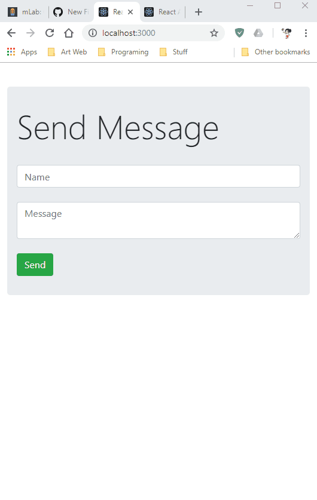

# Real-Time Chat App

This chat application allows users to post a message and have it automatically synchronize across several different browsers using Socket.IO. 
I used React for the front end, set up the database frameworks MongoDb and providers mLab for the back end.

## Resources
Lynda: Learning Node.js by Alexander Zanfir

